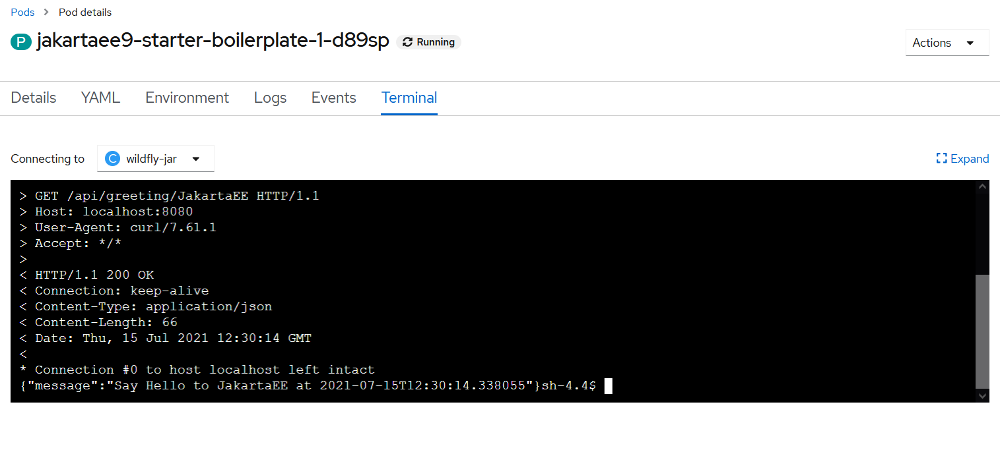

# Deploying Jakarta EE 9 applications with WildFly Bootable JAR

Since WildFly 21 was released, it is possible to build your application and the WildFly runtime into a single fat JAR file through the new `wildfly-jar-maven-plugin` . For developers, through this maven plugin, it brings the well-known Spring Boot building progress to Jakarta EE/WildFly world.

## Prerequisites 

Make sure you have installed the following software.
* Java 11 , OpenJDK or [AdoptOpenJDK](https://adoptopenjdk.net/)
* Apache Maven 3.6+
* [WildFly 24.0.0.Final](https://www.wildfly.org), please download the  *Jakarta EE 9 preview* distribution 
* [OpenShift CLI](https://docs.openshift.com/container-platform/4.2/cli_reference/openshift_cli/getting-started-cli.html)

## Building a Bootable JAR

Firstly add `wildfly-jar-maven-plugin` configuration.

```xml
<plugin>
    <groupId>org.wildfly.plugins</groupId>
    <artifactId>wildfly-jar-maven-plugin</artifactId>
    <version>${wildfly-jar-maven-plugin.version}</version>
    <configuration>
        <feature-pack-location>
            wildfly-preview@maven(org.jboss.universe:community-universe)#${wildfly.version}
        </feature-pack-location>
        <layers>
            <layer>jaxrs</layer>
        </layers>
        <plugin-options>
            <jboss-fork-embedded>true</jboss-fork-embedded>
        </plugin-options>
    </configuration>
    <executions>
        <execution>
            <goals>
                <goal>package</goal>
            </goals>
        </execution>
    </executions>
</plugin>
```

The *feature-pack-location* defines the infrastructure feature it will be used to build the application, and *layers* specifies which layers will be activated

> More details about layers, please refer to the bootable jar documentation and read the [Galleon layers](https://docs.wildfly.org/bootablejar/#wildfly_jar_composing_custom_server_galleon) chapter.

> NOTE: In the feature pack, we use `wildfly-preview` to use the Jakarta EE 9 preview.

Run the following command to build the application.

```bash
mvn clean package -Pwildfly-bootable
```

Besides the generic *war* package built by maven war plugin, there is another jar file with *-bootable.jar* postfix is built by `wildfly-jar-maven-plugin`.

Run the following command to start application.

```bash
java -jar target\jakartaee9-starter-boilerplate-bootable.jar 
```

Use `curl` command to test the sample endpoint.

```bash
curl -v http://localhost:8080/api/greeting/JakartaEE
```

> NOTE: In the generated bootable jar, by default it sets the application context path to root("/").

## Deploying to OpenShift

The `wildfly-jar-maven-plugin` provides out-of-box cloud support. You can use it together with  `openshift-maven-plugin` and build application into docker image from source codes and deploy to the OpenShift cluster.

There are several options to use OpenShift, check [the official website](https://www.openshift.com) for details.

The simplest way is registering RedHat hosted OpenShift cloud, it provides a free *Developer sandbox* plan.  Once you have registered, it will provide you an interactive Web UI for developers and administrators views.  

To use `openshift-maven-plugin` , you have to login firstly. In the OpenShift home page, click the *question(?)* icon button in the top right area, and click the *command line tools* menu item. Copy the *oc login command line* in the opened page. More details, please refer to [this guide](https://developers.redhat.com/blog/2021/04/21/access-your-developer-sandbox-for-red-hat-openshift-from-the-command-line#).

 Assume you have installed [OpenShift CLI](https://docs.openshift.com/container-platform/4.2/cli_reference/openshift_cli/getting-started-cli.html), open a terminal, paste the command to login into the OpenShift cloud.

```
oc login ...
```

Next let's configure the `wildfly-jar-maven-plugin` and `openshift-maven-plugin`.

```xml
<properties>
    <jkube.generator.from>registry.redhat.io/ubi8/openjdk-11:latest</jkube.generator.from>
</properties>
<build>
    <plugins>
        <plugin>
            <groupId>org.wildfly.plugins</groupId>
            <artifactId>wildfly-jar-maven-plugin</artifactId>
            <version>${wildfly-jar-maven-plugin.version}</version>
            <configuration>
                <feature-pack-location>
                    wildfly-preview@maven(org.jboss.universe:community-universe)#${wildfly.version}
                </feature-pack-location>
                <layers>
                    <layer>cloud-server</layer>
                </layers>
                <excluded-layers>
                    <layer>deployment-scanner</layer>
                </excluded-layers>
                <cloud/>
                <plugin-options>
                    <jboss-fork-embedded>true</jboss-fork-embedded>
                </plugin-options>
            </configuration>
            <executions>
                <execution>
                    <goals>
                        <goal>package</goal>
                    </goals>
                </execution>
            </executions>
        </plugin>
        <plugin>
            <groupId>org.eclipse.jkube</groupId>
            <artifactId>openshift-maven-plugin</artifactId>
            <version>${openshift-maven-plugin.version}</version>
            <executions>
                <execution>
                    <goals>
                        <goal>resource</goal>
                        <goal>build</goal>
                    </goals>
                </execution>
            </executions>
            <configuration>
                <enricher>
                    <config>
                        <jkube-service>
                            <type>NodePort</type>
                        </jkube-service>
                    </config>
                </enricher>
            </configuration>
        </plugin>
    </plugins>
</build>
```

Here we use a  *cloud-server* layer instead of the former *jaxrs*, and add another `openshift-maven-plugin` configuration.

> More details about the OpenShift maven plugin, see [Eclipse JKube documentation](https://www.eclipse.org/jkube/docs/openshift-maven-plugin).

Run the following command to deploy application to OpenShift cloud.

```bash
mvn clean oc:deploy -Pwildfly-openshift
```

After it is done, you can watch the pod nodes via the following command.

```bash
oc get pods -w
```

Go to the OpenShift Web UI, and click the *Project* in the left pane, then you can see all related resources, including Pod Nodes, Services, Routes, etc.

Click *Pods*, and select *jakartaee9-starter-boilerplate-1-xxxxx*,  then switch to *Terminal* tab, try to use `curl` to check our application is working well.

```bash
curl -v http://localhost:8080/api/greeting/JakartaEE
```

The result is similar to the following screen.



Go back to *Project* view, and click *Routes*, and select *jakartaee9-starter-boilerplate*. In the detail page, you can find the external URL of this deployed application(or  you can get it via the following command).  

Try to access the sample API endpoint through the external URL.

```bash
$ oc get route jakartaee9-starter-boilerplate -o jsonpath="{.spec.host}"
jakartaee9-starter-boilerplate-hantsy-dev.apps.sandbox-m2.ll9k.p1.openshiftapps.com

$ curl -v http://jakartaee9-starter-boilerplate-hantsy-dev.apps.sandbox-m2.ll9k.p1.openshiftapps.com/api/greeting/JakartaEE

> GET /api/greeting/JakartaEE HTTP/1.1
> Host: jakartaee9-starter-boilerplate-hantsy-dev.apps.sandbox-m2.ll9k.p1.openshiftapps.com
> User-Agent: curl/7.55.1
> Accept: */*
>
< HTTP/1.1 200 OK
< content-type: application/json
< content-length: 66
< date: Thu, 15 Jul 2021 14:02:46 GMT
< set-cookie: 8f1aeb5fdab055810cd99f63982ad17b=1540c81cbcc1728a7c020191c74f5fa7; path=/; HttpOnly
< cache-control: private
<
{"message":"Say Hello to JakartaEE at 2021-07-15T14:02:46.571707"}
```


## Running Arquillian Tests against Bootable JAR

As mentioned in [the last post](https://itnext.io/testing-jakarta-ee-9-applications-with-arquillian-and-wildfly-cd108eec57e2),  WildFly Arqullian project includes a  *bootable* container adapter  for testing against the bootable jar.

Add the following dependency in the project *pom.xml* file.

```xml
<dependency>
    <groupId>org.wildfly.arquillian</groupId>
    <artifactId>wildfly-arquillian-container-bootable</artifactId>
    <version>${wildfly-arquillian.version}</version>
    <scope>test</scope>
</dependency>
// jerseys are omitted.
```

Add `wildfly-jar-maven-plugin` to build a *bootable* fat JAR for testing purpose.

```xml
<plugin>
    <groupId>org.wildfly.plugins</groupId>
    <artifactId>wildfly-jar-maven-plugin</artifactId>
    <version>${wildfly-jar-maven-plugin.version}</version>
    <configuration>
        <feature-pack-location>
            wildfly-preview@maven(org.jboss.universe:community-universe)#${wildfly.version}
        </feature-pack-location>
        <layers>
            <layer>jaxrs</layer>
            <layer>management</layer>
        </layers>
        <excluded-layers>
            <layer>deployment-scanner</layer>
        </excluded-layers>
        <plugin-options>
            <jboss-fork-embedded>true</jboss-fork-embedded>
        </plugin-options>
    </configuration>
    <executions>
        <execution>
            <goals>
                <goal>package</goal>
            </goals>
        </execution>
    </executions>
</plugin>
```

Create a new *container* in the *arquillian.xml* for this adapter.

```xml
<container qualifier="wildfly-bootable-jar" default="true">
    <configuration>
        <property name="jarFile">${bootable.jar}</property>
        <property name="allowConnectingToRunningServer">false</property>
        <property name="managementAddress">127.0.0.1</property>
        <property name="managementPort">9990</property>
        <property name="waitForPorts">9990</property>
        <property name="waitForPortsTimeoutInSeconds">8</property>
    </configuration>
</container>
```

Define a system wide property *bootable.jar* in the configuration of maven failsafe plugin .

```xml
 <plugin>
     <artifactId>maven-failsafe-plugin</artifactId>
     <version>${maven-failsafe-plugin.version}</version>
     <configuration>
         <systemPropertyVariables>
             <bootable.jar>${project.build.directory}/${project.artifactId}-bootable.jar
             </bootable.jar>
             <arquillian.launch>wildfly-bootable-jar</arquillian.launch>
             <java.util.logging.manager>org.jboss.logmanager.LogManager</java.util.logging.manager>
         </systemPropertyVariables>
     </configuration>
</plugin>
```

Now run the tests using the following command.

```bash
mvn clean verify -Parq-wildfly-bootable-jar
```

Grab the [ example codes from my Github](https://github.com/hantsy/jakartaee9-starter-boilerplate).

